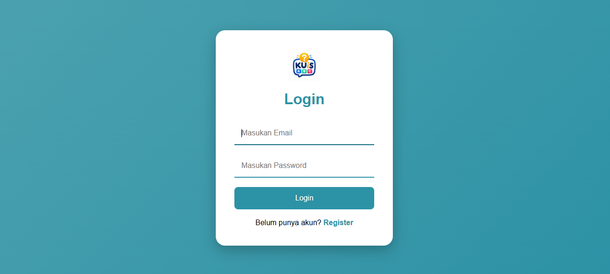
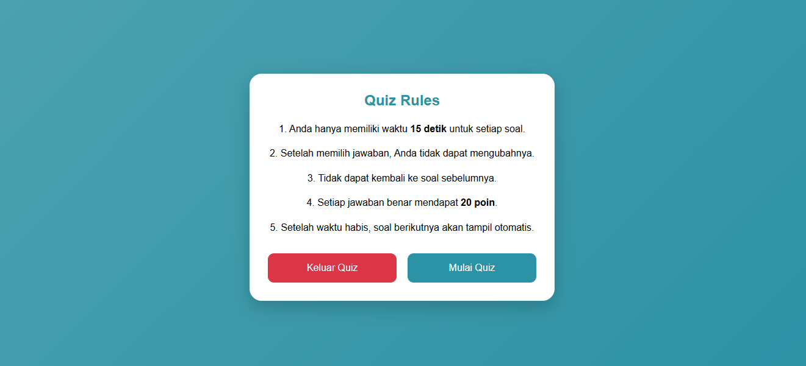
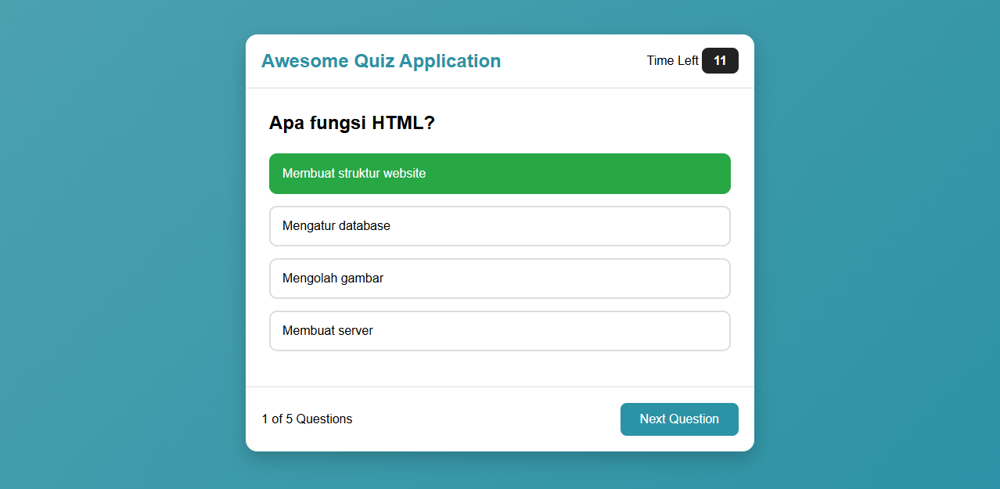
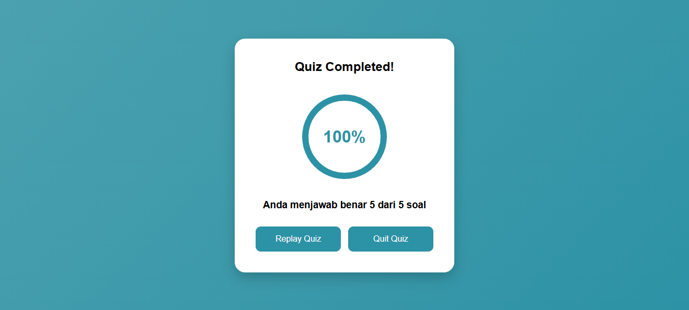

# 🌐 Live Demo

🔗 https://edwinalfadin.github.io/Quizz-App/

# 🧠 Quiz App

  

A modern and responsive Quiz Application built with <b>HTML, CSS, and JavaScript</b>.

  
  
  

---

## 📖 About Project

Quiz App is a web-based quiz application that allows users to register, log in, read quiz rules, answer multiple-choice questions, and view their final score.

The application stores user data and scores using _Local Storage_, making it lightweight and easy to run without a backend.

---

## 🚀 Live Features

- 👤 User Registration
- 🔐 User Login
- 📋 Quiz Rules Page
- ❓ Multiple Choice Quiz
- ⏱️ Countdown Timer
- ✅ Answer Validation
- 🎯 Automatic Score Calculation
- 📊 Result Page
- 🔄 Replay Quiz
- 🚪 Logout / Quit
- 💾 Local Storage
- 📱 Responsive Layout

---

# 📸 Screenshots

## Login Page

---

## Quiz Rules

---

## Quiz Page

---

## Result Page

---

# 🛠️ Technologies Used

- HTML5
- CSS3
- JavaScript (ES6)
- Local Storage API

---

# 📂 Folder Structure

text
Quizz-App/
│
├── assets/
│ ├── logo.png
│ ├── quizLogin.png
│ ├── quizRules.png
│ ├── question.png
│ └── core.png
│
├── css/
│ ├── style.css
│ ├── quiz.css
│ └── result.css
│
├── js/
│ ├── register.js
│ ├── login.js
│ ├── rules.js
│ ├── questions.js
│ ├── quiz.js
│ └── result.js
│
├── register.html
├── login.html
├── rules.html
├── quiz.html
├── result.html
│
└── README.md

---

# ⚙️ Installation

Clone repository

bash
git clone https://github.com/EdwinAlfadin/Quizz-App.git

Go to project directory

bash
cd Quizz-App

Open the project

text
Open login.html using your favorite browser.

---

# 🎮 How to Use

1. Register a new account.
2. Login using your account.
3. Read the quiz rules.
4. Start the quiz.
5. Select the correct answer.
6. Finish all questions.
7. View your final score.
8. Replay the quiz or quit.

---

# 👨‍💻 Author

_Ahmad Edwin Alfadin_

Frontend Developer

GitHub  
https://github.com/EdwinAlfadin

LinkedIn  
https://www.linkedin.com/in/ahmad-edwin-alfadin-alfa

---

# ⭐ Show Your Support

If you like this project, please give it a ⭐ on GitHub.

---

# 📄 License

This project is licensed under the _MIT License_.

